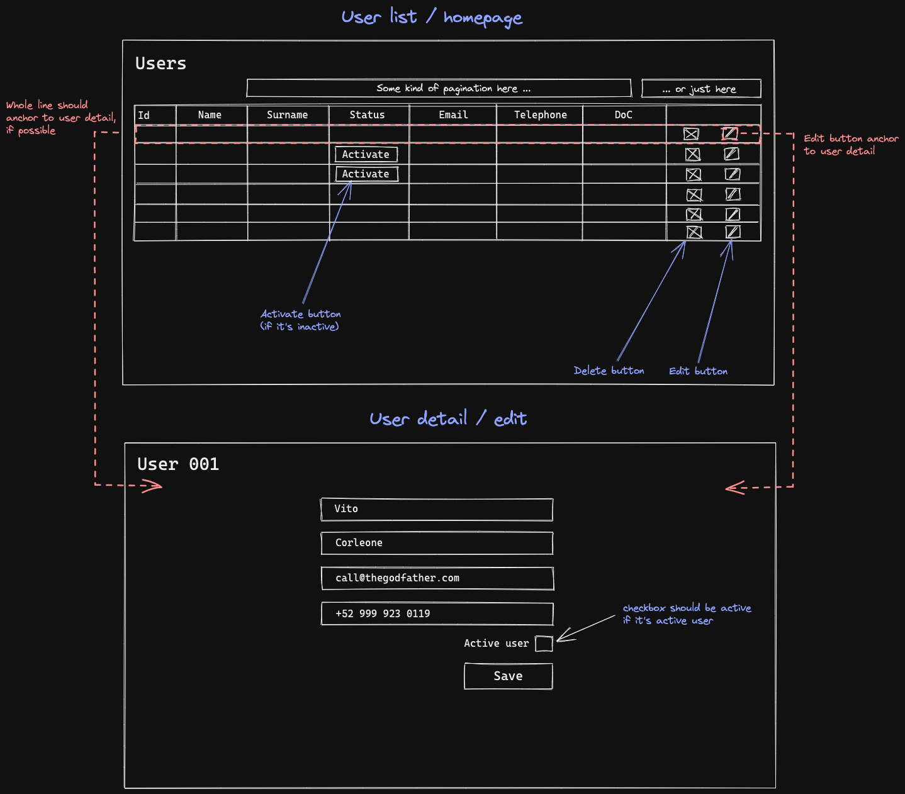

## User admin page 🔑

  
<b>&nbsp;&nbsp;The&nbsp;task</b>

   

Design and create an administration page for user management according to the next verbal description.

The page will display an overview of users. There will be a filter block in front of the overview, which will allow filtering by id, name, status, name and creation date from and to. The overview should be paged.

The user overview will contain the following information: id, name, surname, status (active, deactivated), e-mail, telephone, date of creation.
It will be possible to perform the following actions on each user: activate / deactivate, edit, delete. We use the Primefaces framework (https://www.primefaces.org/) for development.
1. Design a page layout, incl. modal dialogues if needed. The design can be drawn by hand, but it must be legible (we recommend the pencil-paper method).
2. When designing, rely on the components offered by the Primefaces framework.
3. Prepare the page template using a framework.
4. Prepare a presentation View bean.
5. Prepare LazyModel if needed.
6. Prepare a Service bean with actions and with dummy data.
 
 
  

 

  ### How i proceeded 👨‍💻
 

Firstly, I underestimated this from the very beginning. When I was reading the assignment, I thought that Primefaces will be pretty easy to implement just to find out later on that it works with JSF which is apparently connected with enterprise app development which I have never seen before and also that some frontend framework such as React etc knowledge would come handy. 

So I spent some time reading and trying to figure it out, but later I decided to implement at least Primeflex which is some light weight version for styling. Wasn't successful either. 

Ended up running back to MVC and Thymeleaf 😵‍💫 to get as much as possible from what I already know a little.

**Designed this simple page layout 👇**

**To get this at the end 👇**

### Notes
- I am disappointed that I could not find out how to work with enterprise. Was trying it out for a while, downloaded and made Glassfish server functional, but got a bit lost in enviroment of the app template.
- Due to underestimation of the project I was a bit under time pressure which I set myself :)
- Started with basic logic, repository and services.
- Then I added controller and templates.
- Created data seed via CMD Line runner.
- Integrated Thymeleaf and tried out the view.
- Not long after that Bootstrap came to the line. That could seem like and overkill here, but it was faster. Personaly, I don't like styling in html files and all those BT classes etc confuse me as I use it occasinaly. Therefore I don't have as good control over styling as I'd like to.
- <ins>App logic:</ins>
    - Smarter would be to build the whole searching and sorting on Restcontroller and than proceed to the frontend. The way I did it is clumsy.
    - There are few logic spaces in behavior:
        - Date range is not linked.
        - When activate/deactivate user, it redirects to the main page.
        - Pagination doesn't work on search results as I implemented it at the end which was a mistake and it was built on the logic I started with.
        - Went with H2 inmemory db.
- Tests are not done. 😳 Those are my weakness and it would take me one more day to implement them.

Overall, it was fun as allways. I do enjoy fullstack tasks as I really need to practice that and want to become more than capable of using it.

I would rate my output here as *quite good enough due to circumstances* but it would definately need some refactoring and logic improvements. During the presentation I was told that company is fast growing and therefore emphasis is placed on functional, not perfect. That's why I submit the work today as I promised. I am ready to learn and get better 🤓